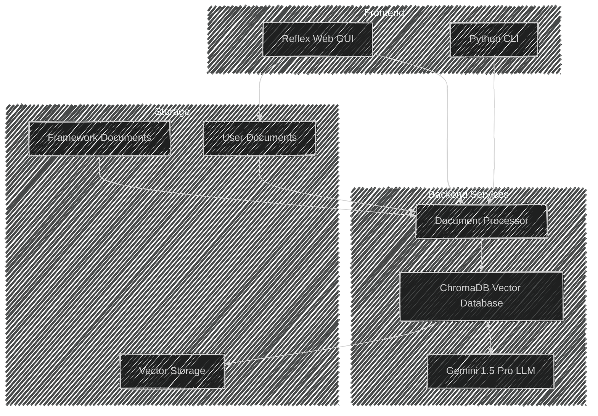

# System Architecture

Focused to establish a simplicstic RAG and CAG system.

## Component Description

| Component          | Description                  | Technology                 |
| ------------------ | ---------------------------- | -------------------------- |
| Web GUI            | User interface               | Reflex (Python)            |
| CLI                | Command-line interface       | Python                     |
| Vector Database    | Document storage & retrieval | ChromaDB                   |
| LLM                | Language model for Q&A       | Google Gemini 1.5 Pro      |
| Document Processor | PDF/text processing          | PyPDF2, LangChain          |
| Storage            | File & vector storage        | Local filesystem, ChromaDB |

## Data Flow

1. User interacts via GUI or CLI
2. Documents are processed and chunked
3. Text chunks are converted to vectors
4. Vectors are stored in ChromaDB
5. User queries trigger similarity search
6. Relevant context is sent to LLM
7. LLM generates response
// ...existing code...

## Sequence Diagram

This sequence diagram illustrates two main flows:
1. Document Upload Process
2. Query and Response Generation

The diagram shows how components interact in a time-ordered sequence, making it clear how data flows through the system during different operations.