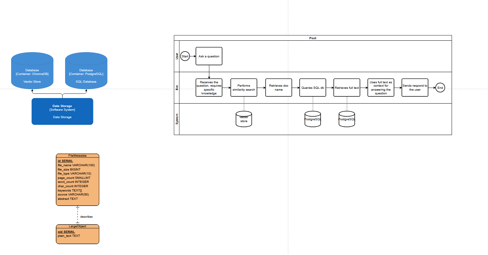
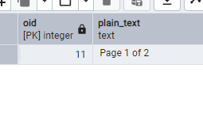
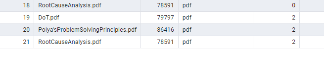
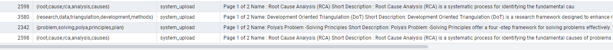

# Table of Contents


# Introduction

Last week I've conducted preliminary research on what technology to use to store system (RAG) documents and also user documents. The most optimal option would be to store the files (pdf's) in a file storage cloud and user information and file metadata in SQL. However, it could take some time and development effort, so I proposed to create the first version of the system entirely in PostgreSQL (potentially with ChromaDB). It has all the necessary extentions we might need (such as extention for sematic search), so it would be sufficient for now. The reason we wouldn't want to stick with this solution long term is limited performance if we store all the files in a single database. It would increase latency, but for the initial stages it shouldn't have much impact.

I've also researched if it would be  easy to migrate to a file storage sysyem later, and the answer was positive. It would indeed require some extra time and intention, but it would be more than doable. 

# Prerequisites

Technology:
- PostgreSQL  - SQL database
- Python - programming language, connection to the rest of the application
- Libraries: psycopg2, SQLAlchemy (t.b.d.)

I was struggling with how to approach the task, so I decided to, first, draw some diagrams to visualize the process and have a starting point.



# Set-up

I began by testing the connection to the database:

```py
# Standard library imports
import os

# Database imports
import psycopg2


db_info = os.getenv("DB_INFO")
if not db_info:
    raise ValueError("Database not found. Please set the DB_INFO environment variable.")

conn = psycopg2.connect(db_info)
cur = conn.cursor()
#------------------------------------------------------------------------------
cur.execute("CREATE TABLE test (id serial PRIMARY KEY, num integer, data varchar);")
cur.execute("INSERT INTO test (num, data) VALUES (%s, %s)", (100, "abc'def"))
cur.fetchone()
conn.commit()

cur.close()
conn.close()
```

As a result, I got a new table with a record in it. Later, I deleted that table since it was just for testing.


After that, I decided to work on document processing function. The goal is to take files that are currently in ```../../kb_new/```, get their metadata and extract text and then upload them to the database that I created. 

I had to change the metadata that is passed through after processing the document and I got rid of chunking for now for simplicity:

```py
metadata = DocumentMetadata(file_name=file_name,
                            file_size=file_size,
                            file_type=file_name.split('.')[-1],
                            page_count=0,  # Placeholder for page count
                            word_count=word_count,
                            char_count=char_count,
                            keywords=[],  # Placeholder for keywords
                            source="system_upload"
                            abstract="", # Placeholder for abstract
                            ).model_dump() 
```

A lot of it is placeholders just to make prototyping faster.
Had to do some bug fixing related to names and class' attributes, but I got the desired output:

```PS D:\GitHub\vino-students> & D:/GitHub/vino-students/.venv/Scripts/python.exe d:/GitHub/vino-students/sql_upload.py
[{'file_name': 'DoT.pdf', 'file_size': 79797, 'file_type': 'pdf', 'page_count': 0, 'word_count': 1018, 'char_count': 3580, 'keywords': [], 'source': 'system_upload', 'abstract': ''}]```

Now I can try to put all this data to the database, along with uploading plain text to a dedicated table.

```py
metadata, content = load_documents_from_directory(NEW_DOCUMENTS_DIR)
def upload_documents_to_db(metadata, content):
    """
    Upload document metadata and content to the PostgreSQL database.
    
    Args:
        metadata: Metadata of the document.
        content: Content of the document.
        
    Returns:
        None
    """
    conn = db_connection()
    cur = create_cursor(conn)

    try:
        # Insert metadata into the database - single document case
        meta = metadata[0]  # Get the single metadata object
        cur.execute("""
            INSERT INTO filemetadata (file_name, file_size, file_type, page_count, word_count, char_count, keywords, source, abstract)
            VALUES (%s, %s, %s, %s, %s, %s, %s, %s, %s)
        """, (meta['file_name'], meta['file_size'], meta['file_type'],
              meta['page_count'], meta['word_count'],
              meta['char_count'], meta['keywords'],
              meta['source'], meta['abstract']))
        
        # Add this before the INSERT statement
        print(f"Content type: {type(content)}")
        print(f"Content length: {len(content) if hasattr(content, '__len__') else 'N/A'}")
        if isinstance(content, list):
            print(f"Content is a list with {len(content)} items")
            doc = content[0]  # Extract first item if it's a list
        else:
            doc = content
        #print(doc)
        # Insert content into the database - single document case
        cur.execute("""
            INSERT INTO largeobject (plain_text)
            VALUES (%s)
        """, (doc,))
        
        conn.commit()
    except Exception as e:
        print(f"Error uploading document to the database: {e}")
        conn.rollback()
    finally:
        cur.close()
        conn.close()

upload_documents_to_db(metadata, content)
```
My editor auto-completed a good portion of this function, but I still had to do a bunch of tweakments such as changing the data type of the passed values and I spent a long time trying to fix a bug that was not really a bug.

The "bug" was that the long text is not displayed fully but is condensed like this:



That's 30 minutes out of my life gone, but I learned something. :)

# Move files to proocessed

I added a function to move processed file to a dedicated folder:

```py
def move_files_to_processed():
    """
    Move processed files from the new documents directory to the processed documents directory.
    
    Returns:
        None
    """
    for file_name in os.listdir(NEW_DOCUMENTS_DIR):
        source_path = os.path.join(NEW_DOCUMENTS_DIR, file_name)
        dest_path = os.path.join(KB_DOCUMENTS_DIR, file_name)
        try:
            os.rename(source_path, dest_path)
            print(f"Moved {file_name} to processed documents.")
        except Exception as e:
            print(f"Error moving {file_name}: {e}")

...

try:
    upload_documents_to_db(metadata, content)
    move_files_to_processed()
except Exception as e:
    print(f"Error in the main process: {e}")
```

It worked, so as a result I got a file moved from "kb_new" to "kb" folder. Next, I will work on the batch upload (rather than just one document).

# Batch upload

I already had the functionality for it before, so I will implement it in the new program. Actually, it's still there, I just need to make sure it still works.

```py
def load_documents_from_directory(directory_path)
    ...
    for file_path in file_paths:
        ...
```
Okay, moving files works, but the problem is in inserting data to the database. While I was working on it, I was focused on getting the connection to work, so I did it with one record only. 

First, I had to put the insert logic in a loop like this:
```py
 for i, meta in enumerate(metadata_list):
            # Insert metadata into the database
            cur.execute("""
                INSERT INTO filemetadata (file_name, file_size, file_type, page_count, word_count, char_count, keywords, source, abstract)
                VALUES (%s, %s, %s, %s, %s, %s, %s, %s, %s)
            """, (meta['file_name'], meta['file_size'], meta['file_type'],
                  meta['page_count'], meta['word_count'],
                  meta['char_count'], meta['keywords'],
                  meta['source'], meta['abstract']))
            
            # Get the corresponding content
            if isinstance(content_list, list) and i < len(content_list):
                doc = content_list[i]
            else:
                print(f"Warning: Content missing for document {meta['file_name']}")
                continue
                
            # Insert content into the database
            cur.execute("""
                INSERT INTO largeobject (plain_text)
                VALUES (%s)
            """, (doc,))
            
            print(f"Uploaded document: {meta['file_name']}")
```

Then I found out that in document_processor.py I am only passing one value so I had to create a list:

```py
...
    all_contents = []
...
    all_metadatas.extend(result.metadatas)
    all_contents.append(content)
...
return all_metadatas, all_contents
```


# Complete metadata

First, I modified the extract_text_from_pdf() to also pass the page_count:

```py
page_count = 0
    try:
        with open(pdf_path, 'rb') as file:
            pdf_reader = PyPDF2.PdfReader(file)
            page_count = len(pdf_reader.pages)
            for page_num in range(page_count):
                page = pdf_reader.pages[page_num]
                text += page.extract_text() + "\n"
    except Exception as e:
        print(f"Error extracting text from PDF {pdf_path}: {e}")
    return text, page_count
```

Then I passed it as one of the metadata parameters:

```py
metadata = KBMetadata(file_name=file_name,
                        file_size=file_size,
                        file_type=file_name.split('.')[-1],
                        page_count=page_count,  # Now using the page count parameter
                        word_count=word_count,
                        char_count=char_count,
                        ...
```
As a result, the amount of pages was passed to the database (they all have 2 pages):



# Keywords and Abstract

I assume for these 2 I will need to use LLM to extract key words and abstract. I am still considering whether abstract should be an extract (a piece of the actual text) or a summary. Since we are already getting keywords via LLM (planning to), doing a summary will not be much effort.

I asked Claude and it suggested python-based solutions. Maybe I will adopt them for the initial implementation, just so I can move on. And it can be then supplemented with AI summary/extraction later.  I think it might be a good idea.

I tried it out and found the result satisfactory (at least for now). I will just continue with development and potentially change the strategy later if needed.

```py 
def extract_keywords(text, max_keywords=5):
    """
    Extract keywords from text using simple frequency analysis.
    
    Args:
        text: Document content
        max_keywords: Maximum number of keywords to return
        
    Returns:
        list: Top keywords
    """
    # Convert to lowercase and split into words
    words = re.findall(r'\b[a-zA-Z]{3,}\b', text.lower())
    
    # Common English stopwords to filter out
    stopwords = {'and', 'the', 'is', 'in', 'to', 'of', 'for', 'with', 'on', 'at', 'from', 
                'by', 'about', 'as', 'it', 'this', 'that', 'be', 'are', 'was', 'were'}
    
    # Filter out stopwords
    filtered_words = [word for word in words if word not in stopwords]
    
    # Count word frequencies
    word_counts = Counter(filtered_words)
    
    # Get the most common words
    return [word for word, _ in word_counts.most_common(max_keywords)]

def generate_abstract(text, max_length=300):
    """
    Generate a simple abstract by taking the first part of the document.
    
    Args:
        text: Document content
        max_length: Maximum length of abstract
        
    Returns:
        str: Document abstract
    """
    # Clean up whitespace
    text = re.sub(r'\s+', ' ', text.strip())
    
    # Take the first part of the document
    abstract = text[:max_length]
    
    # Try to end at a sentence boundary
    if len(text) > max_length:
        last_period = abstract.rfind('.')
        if last_period > max_length // 2:  # Only trim if we have a decent amount of text
            abstract = abstract[:last_period + 1]
    
    return abstract

def process_document_content(file_path: str, content: str, page_count: int = 0
                            ) -> ProcessingResult:
    """
    Process document content into chunks with metadata and IDs.
    
    Args:
        file_path: Path to the source document
        content: Text content to be chunked
        page_count: Number of pages in the document (for PDFs)
        
    Returns:
        ProcessingResult containing document chunks, metadata, ids and chunk count
    """
    result = ProcessingResult()
    file_name = os.path.basename(file_path)
    
    # Skip if no content was extracted
    if not content.strip():
        print(f"Warning: No content extracted from {file_name}")
        return result

    char_count, word_count = char_word_count(content)
    file_size = os.path.getsize(file_path)
    keywords = extract_keywords(content)
    abstract = generate_abstract(content)
    metadata = KBMetadata(file_name=file_name,
                        file_size=file_size,
                        file_type=file_name.split('.')[-1],
                        page_count=page_count,
                        word_count=word_count,
                        char_count=char_count,
                        keywords=keywords,
                        source="system_upload",
                        abstract=abstract,
                        ).model_dump() 
    result.metadatas.append(metadata)
    return result
```


