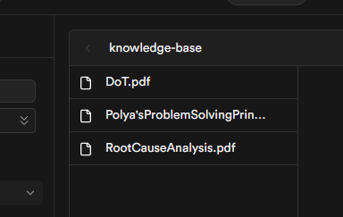
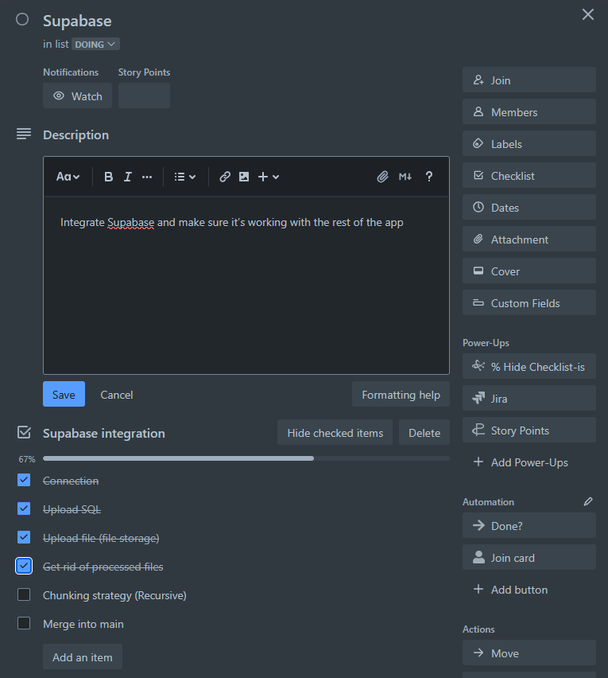
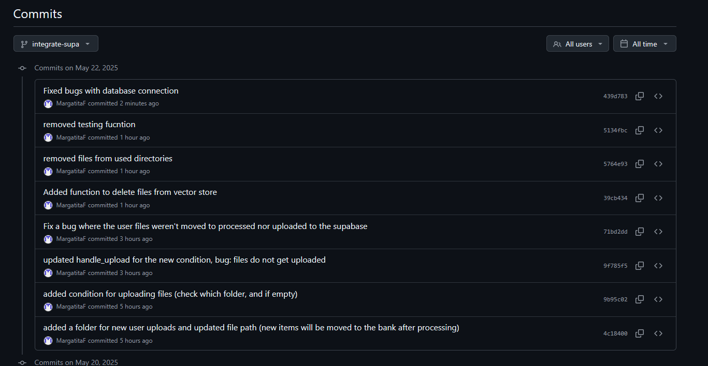
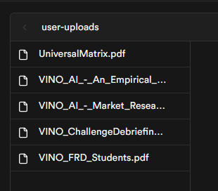
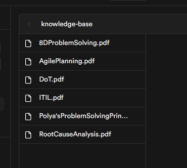
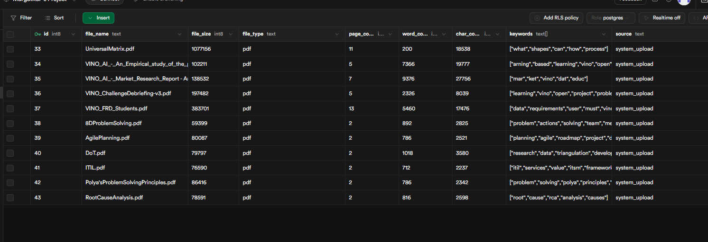
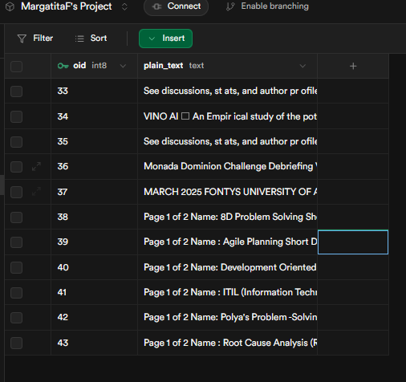
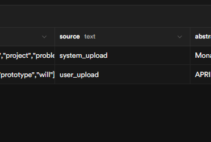

# VINO AI for students || Supabase || devlog

<!-- TOC -->

- [VINO AI for students || Supabase || devlog](#vino-ai-for-students--supabase--devlog)
- [Introduction](#introduction)
- [Foundation](#foundation)
- [File Storage Upload](#file-storage-upload)
- [Fixing user uploads](#fixing-user-uploads)
- [Fixing bugs and Automatic user uploads](#fixing-bugs-and-automatic-user-uploads)

<!-- /TOC -->


# Introduction

The question of how and where to store our data is still pending. Last week I proposed to use primarily SQL for everything (for now), and a lot of decisions were made since then. I will give you a quick update on it.

Zeb suggested to look into Redis, so I did. Initially I got very excited about it, but as I was learning more about it's limitations, I realized it may not be the right solution for us at this moment. I considered Redis-only and Redis+PostgreSQL solutions. The only reason we would implement it is to (considerably) increase the performance of VINO, but right now we have other priorities.

In addition, I made a decision to use cloud-based database hosting. The reason is that currectly I am running our database locally, which means that the server is only running when my laptop is on. If our team wants to collaborate, we need to find a different solution.

There are two options:

1. Cloud-hosted database service.
2. Hosting the server on Artur's computer (he suggested it).

I think the option 2 doesn't make so much sense for now, though it might for deployment.

For option 1 I did quick research with Gemini and Google.

https://g.co/gemini/share/4630f3540361

https://g.co/gemini/share/856da75ed0e1

After comparing the list of features of different databases, I read a little more about the one I liked the most:
https://supabase.com/

And I was impressed by the amount of features and how well it applies to our case. We might consider it for deployment, but for now it definitely sufficient.

# Foundation

I've built a foundation, using supabase guides and my code for psycopg2 module:

<details>
<summary> Supabase Foundation: Code Snippet </summary>

```py
import os
from dotenv import load_dotenv
from supabase import create_client, Client

from config import NEW_DOCUMENTS_DIR, KB_DOCUMENTS_DIR
from document_processor import load_documents_from_directory, extract_text_from_pdf, process_document_content

load_dotenv()

url: str = os.environ.get("SUPABASE_URL") or ""
key: str = os.environ.get("SUPABASE_KEY") or ""
supabase: Client = create_client(url, key) 

metadata, content = load_documents_from_directory(NEW_DOCUMENTS_DIR)

def move_files_to_processed():
    """
    Move processed files from the new documents directory to the processed documents directory.
    
    Returns:
        None
    """
    for file in os.listdir(NEW_DOCUMENTS_DIR):
        source = os.path.join(NEW_DOCUMENTS_DIR, file)
        destination = os.path.join(KB_DOCUMENTS_DIR, file)
        os.rename(source, destination)
    return 'Files moved successfully'

def upload_documents_to_supabase(metadata_list, content_list):
    """
    Upload multiple document metadata and content to Supabase.
    
    Args:
        metadata_list: List of metadata dictionaries for documents.
        content_list: List of document contents.
        
    Returns:
        str: Success message or error information
    """
    try:
        # Process all documents
        for i, meta in enumerate(metadata_list):
            # Get the corresponding content
            if isinstance(content_list, list) and i < len(content_list):
                doc_content = content_list[i]
            else:
                print(f"Warning: Content missing for document {meta['file_name']}")
                continue
                
            # Insert metadata into the filemetadata table
            metadata_response = (
                supabase.table("filemetadata")
                .insert({
                    "file_name": meta['file_name'],
                    "file_size": meta['file_size'],
                    "file_type": meta['file_type'],
                    "page_count": meta['page_count'],
                    "word_count": meta['word_count'],
                    "char_count": meta['char_count'],
                    "keywords": meta['keywords'],
                    "source": meta['source'],
                    "abstract": meta['abstract']
                })
                .execute()
            )
            
            # Get the ID of the newly inserted metadata record
            metadata_id = metadata_response.data[0]['id']
            
            # Insert content into the largeobject table with reference to metadata
            content_response = (
                supabase.table("largeobject")
                .insert({
                    "oid": metadata_id,
                    "plain_text": doc_content
                })
                .execute()
            )
            
            print(f"Uploaded document: {meta['file_name']}")
        
        return "All documents uploaded successfully"
    except Exception as e:
        error_message = f"Error uploading documents to Supabase: {str(e)}"
        print(error_message)
        return error_message

try:
    upload_documents_to_supabase(metadata, content)
    move_files_to_processed()
except Exception as e:
    error_message = f"Error uploading documents to Supabase: {str(e)}"
    print(error_message)
```
</details>

This program loads the documents from a dedicated directory, extracts its metadata and text, uploads it to supabase (postgreSQL) and moves processed files to another folder.

# File Storage Upload

Supabase also offers file storage functionality, which I assume  acts as object storage. I was able to download the PDF's I uploaded earlier. I don't know to what extend I can access the files, what I can do with them. I belive there is also a semantic search, but I don't know if it's only for the database or the files. Probably there will need to be a vector store instance. 

For now, I want to focus on my python program uploading the processed files to the file storage. I found this page, which should help me with that:
https://supabase.com/docs/guides/storage/uploads/standard-uploads?queryGroups=language&language=python

I had to make changes in this function (former move_to_processed() ):

```py
#supa.py
def upload_move_to_processed():
    """
    Upload to file storage and move processed files from the new documents directory to the processed documents directory.
    
    Returns:
        str: Success message
    """
    for file in os.listdir(NEW_DOCUMENTS_DIR):
        source = os.path.join(NEW_DOCUMENTS_DIR, file)
        try:
            response = supabase.storage.from_('knowledge-base').upload(file, source)
            print(f"Successfully uploaded: {file}")
            destination = os.path.join(KB_DOCUMENTS_DIR, file)
            os.rename(source, destination)
        except Exception as e:
            print(f"Error uploading {file}: {e}")
            continue
    return 'Files uploaded and moved successfully'
```



Trello ticket:



I merged the changes into main and surprisingly I didn't encounter any merge conflicts, even though I was working on this branch for 2 weeks. I think it's because I separated separate functionality into different files.

Although all the new functionality is kind of on it's own, and not integrated with the rest of the app. I will create a separate program to run that will upload the files to supabase.

I had to refactor it a little bit, but now we have a small program([upload_supa.py](../../../upload_supa.py)) that can handle file upload to supabase. If there are any other operations with the db, they can be also added to [supa.py](../../../supa.py).

```py
#upload_supa.py
""" Program to upload a files to Supabase storage."""

from supa import upload_move_to_processed, upload_documents_to_sql
from document_processor import load_documents_from_directory

from config import NEW_DOCUMENTS_DIR

if __name__ == "__main__":
    metadata, content = load_documents_from_directory(NEW_DOCUMENTS_DIR)
    try:
        upload_documents_to_sql(metadata, content)
        upload_move_to_processed()
    except Exception as e:
        error_message = f"Error uploading documents to Supabase: {str(e)}"
        print(error_message)
```

# Fixing user uploads

While working on a different file upload strategy, I didn't pay attention to user uploads, and today I decided to fix it. I got the user uploads to work again, but there are a few bugs. The following files were updated:

[database.py](../../../database.py)

[document_processor.py](../../../document_processor.py)

[APIendpoint.py](../../../APIendpoint.py)

I was mainly adjusting the parameters I was passing through metadata. 
Bugs that need to be fixed:
1. When I view the contents of the vector store, the source of the files are displayed correctly. But if I do it via CLI it shows "system_upload" for user documents. I don't know why that is.
2. VINO AI isn't displaying all the uploaded documents correctly. I don't remember if it every did (in the web-version).

! It's not a bug, but user uploads need to be connected to Supabase.

# Fixing bugs and Automatic user uploads

Earlier I described 2 bugs and 1 task that I need to do the next day. This is the next day, and I am very happy that I managed to fix those bugs and one extra! An extra bug was that after automating user uploads, the database connection was failing.
I wasn't documenting the process, but my git commits speak for themselves:



What I've done today: 

Fixed:
- Incorrect listing of uploaded files
- Incorrect "source" field
- Failing database connection

+ Automated user uploads to vector store and supabase

Supabase user-uploaded PDFs:



Knowledge base items (manual upload by running [upload_supa.py](../../../upload_supa.py)):



Added to SQL files (must change it so duplicates are not allowed) (I just noticed the  source is wrong again, even though it's correct in the vector store):



Full text from the added files:



And I plan to clean up the code a little bit, because it's became a bit of a mess during the process.

# Fixing bug with a source (again)

Previously, I fixed a bug with the source (it would always be system_upload). At least, I thought that I fixed it, because I only checked the CLI output. In reality, the documents were uploaded to the SQL database with the wrong source. 

It took me a few shots, but in the end of the day this is the line that needed to be fixed:

```py 
# APIendpoint.py
## handle_upload.py()
...
try:
    success = process_directory(NEW_USER_UPLOADS_DIR, USER_UPLOADS_DIR, source="user_upload")
    print(f"Result of process_directory: {success}")
...
```

This is the result:



# Conclusion

To summarize, I was able to transfer and integrate PostgreSQL within VINO AI for students, using cloud db-hosting Supabase. It was not too challenging, I was able to progress from one step to another quite quickly.

The main difficulty was to make sure all the parameters are correctly passed across multiple functions and also files. Most of the errors and bugs were related to the passing of metadata.

I am satisfied with the result I got at this moment. There will need to be more work done to ensure our application can use the files in the databases.