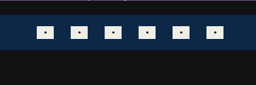
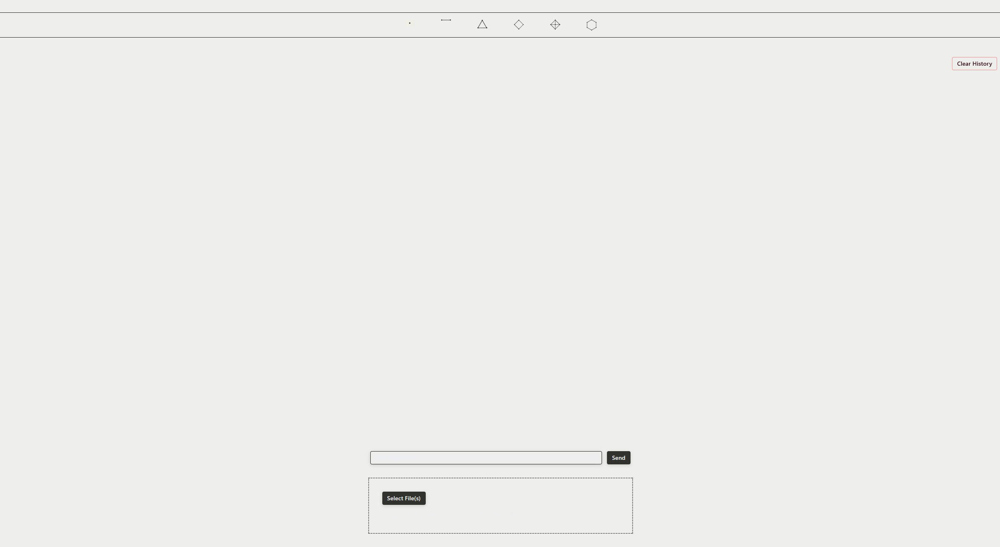

# Table of Contents

1. [Introduction](#introduction)

# Introduction

With the Proof of Concept we demonstrated the core functionality of VINO AI. We didn't focus on the User Experience aspect at all, so coaches had a lot of questions about it.

As a first step, we want to implement a navigation bar, that will display 6 cards (as 6 steps) and highlight the current step.

Reference: https://reflex.dev/docs/recipes/layout/navbar/?q=navbar

Example:

```python
def navbar() -> rx.Component:
    return rx.box(
        rx.desktop_only(
            rx.hstack(
                rx.hstack(
                    rx.image(
                        src="/logo.jpg",
                        width="2.25em",
                        height="auto",
                        border_radius="25%",
                    ),
                    rx.heading(
                        "Reflex", size="7", weight="bold"
                    ),
                    align_items="center",
                ),
                rx.hstack(
                    navbar_link("Home", "/#"),
                    navbar_link("About", "/#"),
                    navbar_link("Pricing", "/#"),
                    navbar_link("Contact", "/#"),
                    justify="end",
                    spacing="5",
                ),
                justify="between",
                align_items="center",
            ),
        ),
        rx.mobile_and_tablet(
            rx.hstack(
                rx.hstack(
                    rx.image(
                        src="/logo.jpg",
                        width="2em",
                        height="auto",
                        border_radius="25%",
                    ),
                    rx.heading(
                        "Reflex", size="6", weight="bold"
                    ),
                    align_items="center",
                ),
                rx.menu.root(
                    rx.menu.trigger(
                        rx.icon("menu", size=30)
                    ),
                    rx.menu.content(
                        rx.menu.item("Home"),
                        rx.menu.item("About"),
                        rx.menu.item("Pricing"),
                        rx.menu.item("Contact"),
                    ),
                    justify="end",
                ),
                justify="between",
                align_items="center",
            ),
        ),
        bg=rx.color("accent", 3),
        padding="1em",
        # position="fixed",
        # top="0px",
        # z_index="5",
        width="100%",
    )
```

I adapted this code to accomodate 6 numbers (that will later be replaced with card images) and put it in [vino-studens.py](../../vino_students/vino_students.py)

```python
...
def navbar_link(text: str, url: str) -> rx.Component:
    return rx.link(
        rx.text(text, size="4", weight="medium"), href=url
    )


def navbar() -> rx.Component:
    return rx.box(
        rx.desktop_only(
            rx.hstack(
                rx.hstack(
                    navbar_link("1", "/#"),
                    navbar_link("2", "/#"),
                    navbar_link("3", "/#"),
                    navbar_link("4", "/#"),
                    navbar_link("5", "/#"),
                    navbar_link("6", "/#"),
                    justify="center",
                    spacing="",
                    width="100%",
                ),
                width="100%",
                align_items="center",
            ),
        ),
        bg=rx.color("accent", 3),
        padding="1em",
        position="fixed",
        top="20px",
        z_index="5",  # Uncommented to ensure navbar appears above content
        width="100%",
    )
    ...
```

And I had to reference it in the index() like so: ```navbar()``` 


The important question is whether we can put pictures instead of text, because that's the most important part. Turns out, it is relatively easy to do. Just need to specify the properties, and one of them should be the path to the picture (must be in assets folder or absolute path).

```python
...
def navbar_link(url: str, image_src: str = None, text: str = None, image_size: str = "1.5em") -> rx.Component:
    if image_src:
        return rx.link(
            rx.image(
                src=image_src,
                width=image_size,
                height="auto",
                alt=text or "Navigation icon"
            ),
            href=url
        )
    else:
        return rx.link(
            rx.text(text, size="4", weight="medium"), 
            href=url
        )
        # ------------------------------------
        ...
        # ------------------------------------
                rx.hstack(
                    navbar_link(url="/#", image_src="/step1.png", text="Step 1"),
                    navbar_link(url="/#", image_src="/step1.png", text="Step 1"),
                    navbar_link(url="/#", image_src="/step1.png", text="Step 1"),
                    navbar_link(url="/#", image_src="/step1.png", text="Step 1"),
                    navbar_link(url="/#", image_src="/step1.png", text="Step 1"),
                    navbar_link(url="/#", image_src="/step1.png", text="Step 1"),
                    )
        # ------------------------------------
        ...
```

I used a random screenshot of the first step, but we should design proper cards ourselves. But it works as a test, just to show that it's possible. It should also be much wider.



Okay, now I am now farther in the process but I didn't document it. I will give you a quick recap, based on this screenshot:

 

As you can see, there are some changes. I changed the theme and the color icons. 

Will will need to:
- Make uniform cards for each card (similar to the paper prototype)
- Make the symbols spread wider
- Obv we will work on the looks and ux
Additionally:
- Clear history button will stay for now for testing reasons
- "Select files" will need to be changed, but for now it stays like this