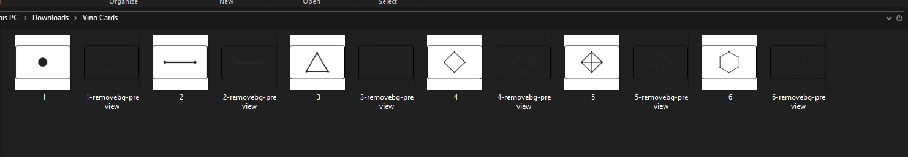
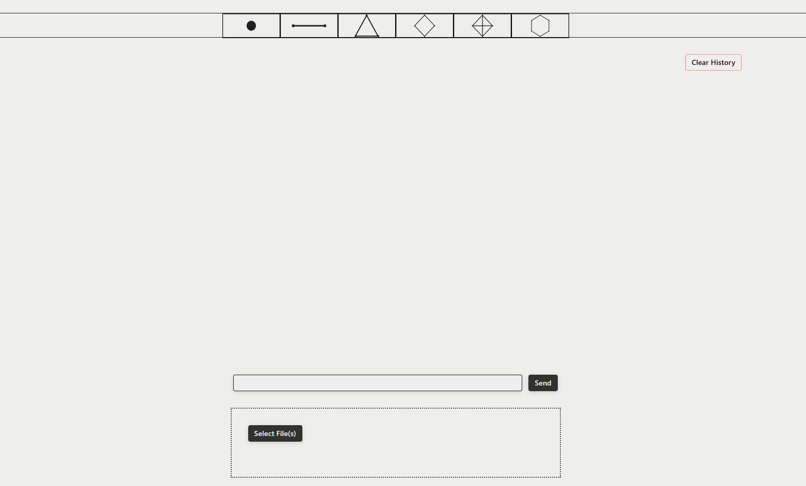
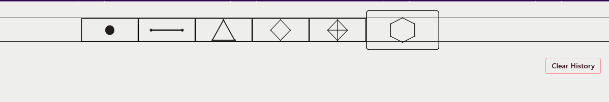
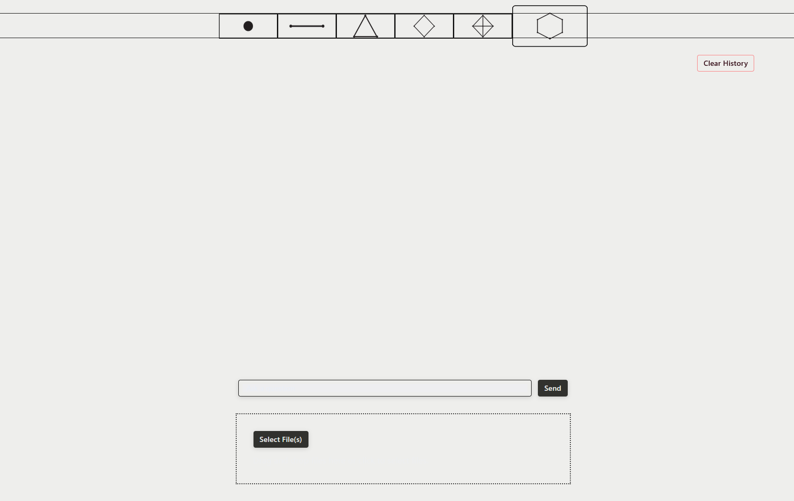
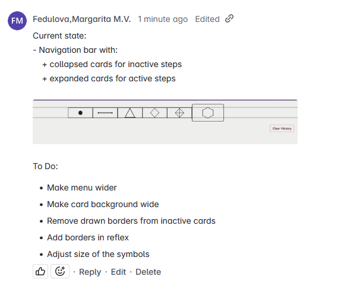

# Table of Contents

1. [Introduction](#introduction)
2. [Simple navbar](#simple-navbar)
3. [Implementing Cards](#implementing-cards)
4. [Change UI](#change-ui)
5. [Implementing Cards #2](#implementing-cards-2)
6. [Expanded card for active step](#expanded-card-for-active-step)

# Introduction

With the Proof of Concept we demonstrated the core functionality of VINO AI. We didn't focus on the User Experience aspect at all, so coaches had a lot of questions about it.

As a first step, we want to implement a navigation bar, that will display 6 cards (as 6 steps) and highlight the current step.

# Simple navbar

Reference: https://reflex.dev/docs/recipes/layout/navbar/?q=navbar

Example:

```python
def navbar() -> rx.Component:
    return rx.box(
        rx.desktop_only(
            rx.hstack(
                rx.hstack(
                    rx.image(
                        src="/logo.jpg",
                        width="2.25em",
                        height="auto",
                        border_radius="25%",
                    ),
                    rx.heading(
                        "Reflex", size="7", weight="bold"
                    ),
                    align_items="center",
                ),
                rx.hstack(
                    navbar_link("Home", "/#"),
                    navbar_link("About", "/#"),
                    navbar_link("Pricing", "/#"),
                    navbar_link("Contact", "/#"),
                    justify="end",
                    spacing="5",
                ),
                justify="between",
                align_items="center",
            ),
        ),
        rx.mobile_and_tablet(
            rx.hstack(
                rx.hstack(
                    rx.image(
                        src="/logo.jpg",
                        width="2em",
                        height="auto",
                        border_radius="25%",
                    ),
                    rx.heading(
                        "Reflex", size="6", weight="bold"
                    ),
                    align_items="center",
                ),
                rx.menu.root(
                    rx.menu.trigger(
                        rx.icon("menu", size=30)
                    ),
                    rx.menu.content(
                        rx.menu.item("Home"),
                        rx.menu.item("About"),
                        rx.menu.item("Pricing"),
                        rx.menu.item("Contact"),
                    ),
                    justify="end",
                ),
                justify="between",
                align_items="center",
            ),
        ),
        bg=rx.color("accent", 3),
        padding="1em",
        # position="fixed",
        # top="0px",
        # z_index="5",
        width="100%",
    )
```

I adapted this code to accomodate 6 numbers (that will later be replaced with card images) and put it in [vino-studens.py](../../vino_students/vino_students.py)

```python
...
def navbar_link(text: str, url: str) -> rx.Component:
    return rx.link(
        rx.text(text, size="4", weight="medium"), href=url
    )


def navbar() -> rx.Component:
    return rx.box(
        rx.desktop_only(
            rx.hstack(
                rx.hstack(
                    navbar_link("1", "/#"),
                    navbar_link("2", "/#"),
                    navbar_link("3", "/#"),
                    navbar_link("4", "/#"),
                    navbar_link("5", "/#"),
                    navbar_link("6", "/#"),
                    justify="center",
                    spacing="",
                    width="100%",
                ),
                width="100%",
                align_items="center",
            ),
        ),
        bg=rx.color("accent", 3),
        padding="1em",
        position="fixed",
        top="20px",
        z_index="5",  # Uncommented to ensure navbar appears above content
        width="100%",
    )
    ...
```

And I had to reference it in the index() like so: ```navbar()``` 

# Implementing cards

The important question is whether we can put pictures instead of text, because that's the most important part. Turns out, it is relatively easy to do. Just need to specify the properties, and one of them should be the path to the picture (must be in assets folder or absolute path).

```python
...
def navbar_link(url: str, image_src: str = None, text: str = None, image_size: str = "1.5em") -> rx.Component:
    if image_src:
        return rx.link(
            rx.image(
                src=image_src,
                width=image_size,
                height="auto",
                alt=text or "Navigation icon"
            ),
            href=url
        )
    else:
        return rx.link(
            rx.text(text, size="4", weight="medium"), 
            href=url
        )
        # ------------------------------------
        ...
        # ------------------------------------
                rx.hstack(
                    navbar_link(url="/#", image_src="/step1.png", text="Step 1"),
                    navbar_link(url="/#", image_src="/step1.png", text="Step 1"),
                    navbar_link(url="/#", image_src="/step1.png", text="Step 1"),
                    navbar_link(url="/#", image_src="/step1.png", text="Step 1"),
                    navbar_link(url="/#", image_src="/step1.png", text="Step 1"),
                    navbar_link(url="/#", image_src="/step1.png", text="Step 1"),
                    )
        # ------------------------------------
        ...
```

I used a random screenshot of the first step, but we should design proper cards ourselves. But it works as a test, just to show that it's possible. It should also be much wider.


# Change UI

Okay, now I am now farther in the process but I didn't document it. I will give you a quick recap, based on this screenshot:

 

As you can see, there are some changes. I changed the theme and the color icons. 

Will will need to:
- Make uniform cards for each step (similar to the paper prototype)
- Make the symbols spread wider
- Obv we will work on the looks and ux
Additionally:
- Clear history button will stay for now for testing reasons
- "Select files" will need to be changed, but for now it stays like this

# Implementing cards #2

I designed this set of cards for quick testing:



And a collapsed version for when a step is not selected:

![Quick Cards Collapsed]](pics/quick_cards_collapsed.png)

I uploaded the new collapsed cards so they are displayed like this. I mainly had to adjust the high of the objects and paddings. Pictures will need to be remade, I made them quickly for demostration and testing purposes. Should remove borders and utilize relfex's borders. Should keep borders on not-collapsed cards, but make sure styles fit.



# Expanded card for active step

Next step is to replace collapsed card with an extended one for the *active* card. I know it's not hard to do in css, but need to find how to do it in Reflex.

I added a state variable for tracking current step:

```py
    active_step: int = 1 # By default, the first step is active

    def set_active_step(self, step_number: int):
        """Set the active step/menu item."""
        self.active_step = step_number
        print(f"Active step set to {step_number}")
```

Then, I had to modify how the image is displayed. Original function:

```py
def navbar_link(url: str, image_src: str = None, text: str = None, image_size: str = "1.5em") -> rx.Component:
    if image_src:
        return rx.link(
            rx.image(
                src=image_src,
                width="7em",
                height="3em",
                alt=text or "Navigation icon",
                fit="contain",
            ),
            href=url,
            height="3em",
            display="flex",
            align_items="center"
        )
    else:
        return rx.link(
            rx.text(text, size="4", weight="medium"), 
            href=url
        )
```

This functionality can stay for inactive steps (collapsed) (or for text only), but I need to add a second condition for when the step is selected.

```py 
def navbar_link(url: str, default_image_src: str, active_image_src: str = None, 
                step_number: int = None, text: str = None, image_size: str = "1.5em") -> rx.Component:
    if active_image_src and step_number is not None:
        # Swap images based on active state
        return rx.link(
            rx.cond(
                State.active_step == step_number,
                # Show active image when this step is active
                rx.image(
                        src=active_image_src,
                        width="9em",
                        height="5em",
                        alt=text or f"Step {step_number}",
                        fit="contain",
                    ),
                # Show default image otherwise
                rx.image(
                    src=default_image_src,
                    width="7em",
                    height="3em",
                    alt=text or f"Step {step_number}",
                    fit="contain",
                ),
            ),
            href=url,
            height="3em",
            display="flex",
            align_items="center",
            on_click=State.set_active_step(step_number),
        )
    elif default_image_src:
        # Original image-only link handling
        return rx.link(
            rx.image(
                src=default_image_src,
                width="7em",
                height="3em",
                alt=text or "Navigation icon",
                fit="contain",
            ),
            href=url,
            height="3em",
            display="flex",
            align_items="center"
        )
    else:
        # Text-only link handling
        return rx.link(
            rx.text(text, size="4", weight="medium"), 
            href=url
        )
```

I also had to adjust the links in navbar. This is what the menu looks like right now:



It is pretty much exactly what I was aiming for, only that I will need to remake the cards (remove drawn borders, add them in reflex instead, add white background to the cards) and make the whole menu wider, because now it only takes the space of the input, but I don't like how it looks. It's okay but I think it will be better then. Screenshot:



Jira Agenda:


